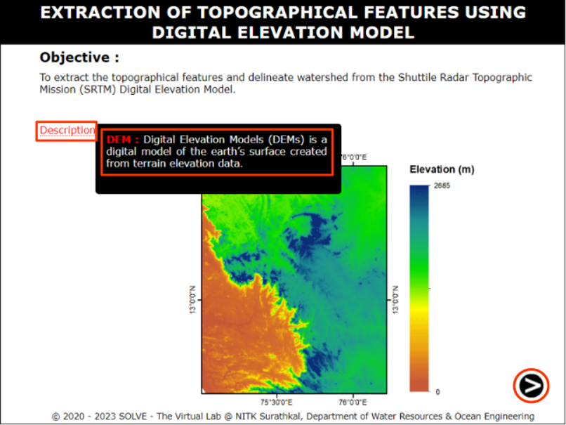
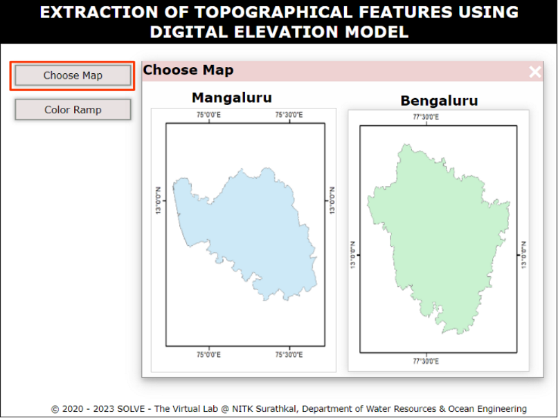
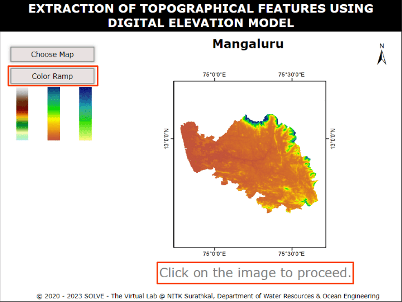
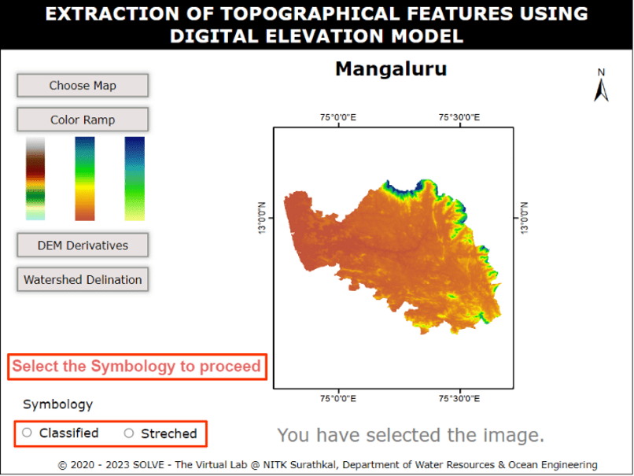
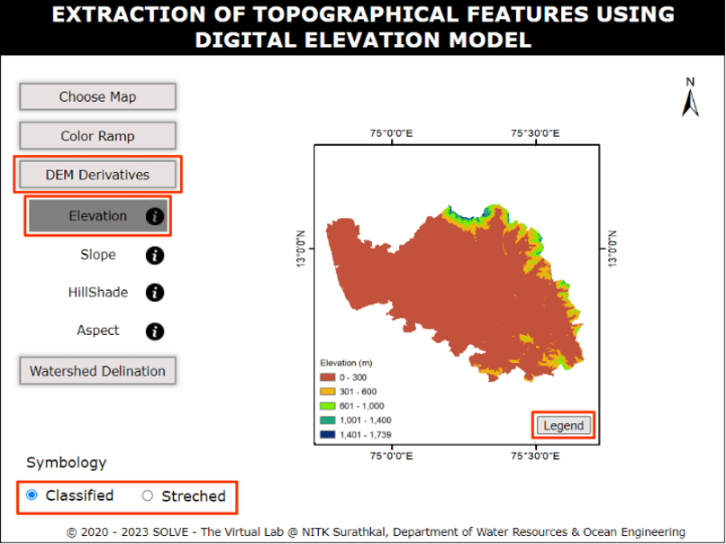
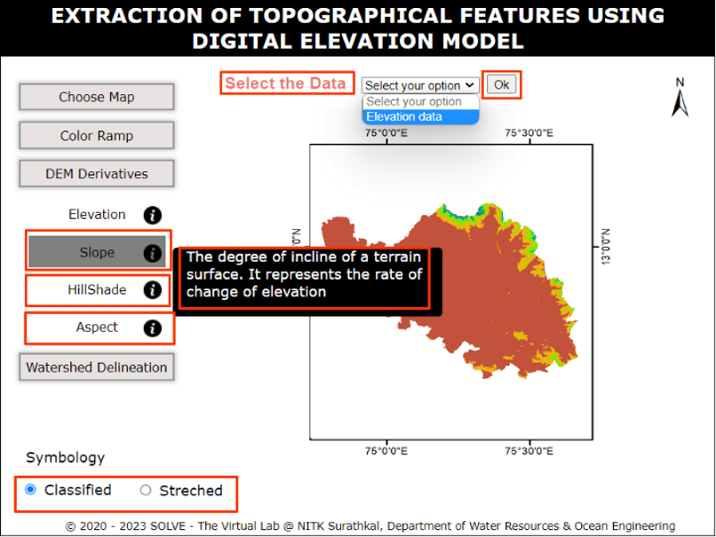
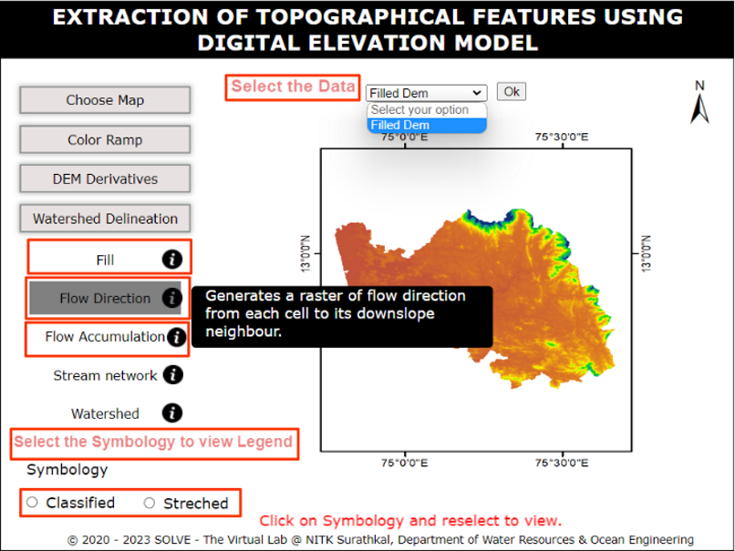
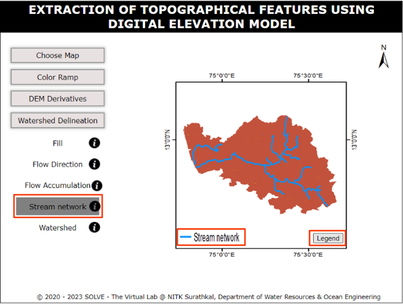
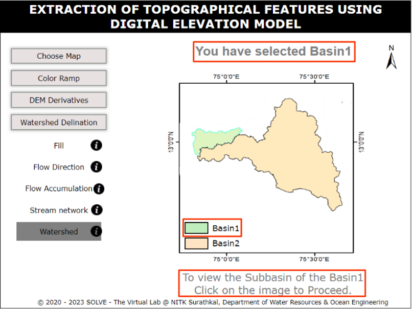
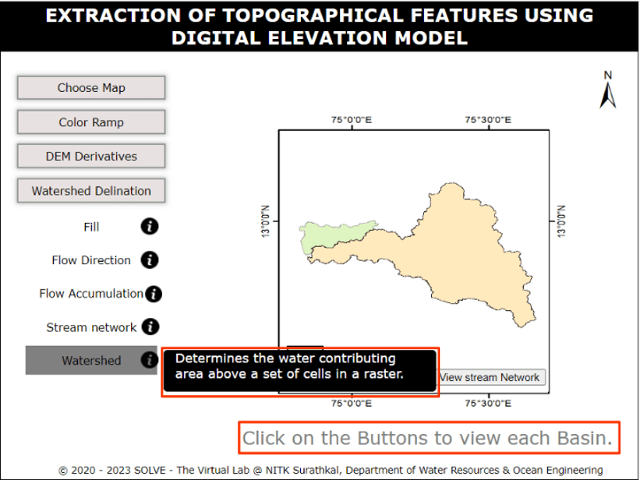

### Procedure

1. Click on the experiment, a window will open with objective. Click on description tab to understand the terminology in the experiment, click on the NEXT button to proceed.

2. Click on the Choose Map tab to select the map provided to proceed.

3. Click on the Color Ramp tab to select either of the colour ramp provided to proceed.

4. After selecting the Color Ramp click on the image to select the map then select a symbology.

5. Click on the DEM Derivatives, a subtab will be displayed. Select one of them, then click on the required symbology, hover on legend tab to view Legend.

6. To view the slope, Hillshade and Aspect select the data then give OK. Now click on the required symbology, hover on legend tab to view elevation range.

7. To view the Fill, Flow Direction and Flow Accumulation, select the data then give OK. Now click on the required symbology, hover on legend tab to view elevation range.

8. Click on the Stream Network to view the river Network flow.

9. Click on the watershed to view Basins.

10. Click on the selected map to view a subbasins.

