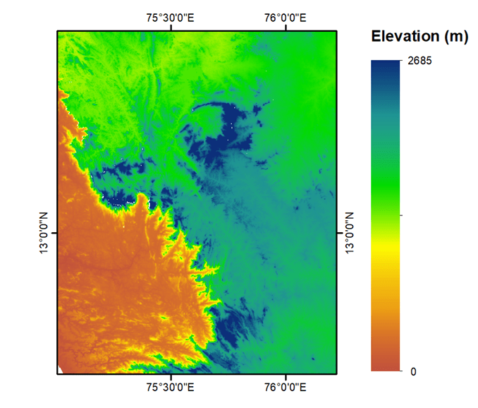
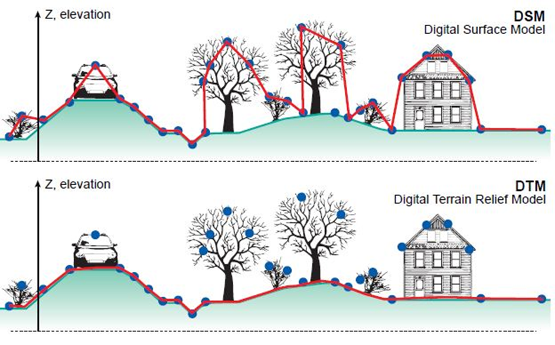

### Theory:

An essential component of geological, geomorphological, hydrological, agricultural, and disaster planning and management is a landscape model of the planet. The Digital Elevation Models (DEM) give a digital representation of surface characteristics as elevation, slope, terrain relief, aspect, and curvature. The simplicity of use and excellent spatial resolution of open-source DEMs have demonstrated considerable promise as an alternative to conventional surveying techniques. The raster value in each cell indicates the elevation of the at particular location. The quality of a DEM is determined by the precision with which the elevation is represented at each pixel (absolute accuracy) and by the precision with which the morphology is represented (relative accuracy). A number of factors such as roughness of the landscape, the number of elevation samples taken, the size/resolution of the pixels, interpolation, will affect the quality of DEMs and terrain analysis algorithm used vertical resolution.

Figure: The DEM representing spatial variation in the elevation 

The DTM is a DEM that represents the topography of the bare earth surface. Digital Surface Model (DSM) is a DEM of the shape of the surface, including vegetation, infra-structures etc on the earth surface. The difference in the DTM and DSM are shown in below figure.

 

Figure: The representation of DTM and DSM

source: <a href="https://www.cdema.org/virtuallibrary/index.php/charim-hbook/data-management-book/3-base-data-collection/3-2-digital-elevation-models">https://www.cdema.org/virtuallibrary/index.php/charim-hbook/data-management-book/3-base-data-collection/3-2-digital-elevation-models</a>

 
Shuttle Radar Topography Mission (SRTM) DEM of 30 m and 90 m <a href="https://earthexplorer.usgs.gov/">https://earthexplorer.usgs.gov/</a>, Advanced Space Borne Thermal Emission and Reflection Radiometer (ASTER)-Global DEM of 30 m <a href="https://earthexplorer.usgs.gov/">https://earthexplorer.usgs.gov/</a>, ALOS world-3D of 12.5m and 30 m <a href="https://global.jaxa.jp/">https://global.jaxa.jp/</a>, CARTOSAT-1 an Indian national DEM of 30 m resolution <a href="https://bhuvan.nrsc.gov.in/bhuvan_links.php">https://bhuvan.nrsc.gov.in/bhuvan_links.php</a>, TanDEM-X of 90 m resolution <a href="https://tandemx-science.dlr.de/">https://tandemx-science.dlr.de/</a> are freely available for the user community. From these the Elevation, Slope, Roughness, Aspect, Hillshade, Curvature, Contours can be derived. Also, the river basins can be extracted after carrying out the watershed delineation process. The detailed methodology to extract the below highlighted features are explained in the simulation.
